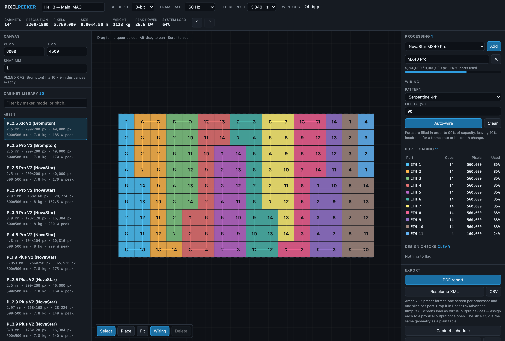

# Pixel Peeker user guide

Pixel Peeker is **a browser tool for designing LED video walls**: lay out cabinets on a canvas, add
processors, wire the ports, and find out whether it actually fits — **before you find out on site.**

Runs entirely in the browser. No account, no server, nothing uploaded.

*An 8 m × 4.5 m wall: 144 cabinets, 3200×1800, 26.6 kW peak, serpentine-wired to 90% fill. The
processor carries it on 11 of 20 ports at 64% device load — each colour on the canvas is one port.*

> **Before you rely on this:** the capacity model is verified numerically — it reproduces
> NovaStar's three published MX40 Pro per-port figures **to the pixel** and Brompton's published
> SX40 headline, and those are pinned as tests. The cabinet library was parsed from manufacturer
> datasheet PDFs, **each record carrying its source**.
>
> **It has not been used to design a wall that was then built.** No processor, receiving card or
> panel has been connected to it, and the Resolume file has not been opened in a running Arena.
> **Status: alpha**, and the cabinet library is small.
>
> This codebase was created with AI assistance, directed and reviewed by a human author.

---

## The bit that matters: port capacity

Most LED capacity spreadsheets compute `pixels = link rate ÷ (3 × bit depth) ÷ frame rate`.

**That is wrong at 10-bit, and wrong in the direction that gets you into trouble — it overstates
capacity by about 7%.**

Controllers pack each colour component into a **power-of-two container**, so the DMA engine stays
word-aligned:

| Bit depth | Naive (3 × depth) | Actual container |
|---|---|---|
| 8-bit | 24 bits/px | **24 bits/px** |
| 10-bit | 30 bits/px | **32 bits/px** |
| 12-bit | 36 bits/px | **48 bits/px** |

With those containers, one link-efficiency figure reproduces the manufacturer's own published
per-port numbers exactly — which is why the model is trusted rather than the arithmetic being
plausible.

**If a spreadsheet says a wall fits at 10-bit and this says it does not, this is the one to
believe.**

---

## Laying out a wall

Pick a cabinet from the library, or define a custom panel by resolution and receiving card. Then
fill a canvas, build blocks, or place tiles by hand.

- **New and dragged cabinets snap flush** against the ones already up.
- **Arrow keys extend a run** one cabinet at a time.
- **Shift locks a drag to 45°.**

---

## Processing and wiring

NovaStar and Brompton controllers, with their real port counts, input connectors and **device
capacity limits** — which are a separate limit from the sum of the ports, and the one that catches
people.

**Auto-wire** in serpentine or column order to a chosen fill limit, or patch ports by hand.

Every port shows its **load, its headroom, and the highest frame rate it could sustain at that
load** — that last figure being the one to check before promising 60 Hz on a 10-bit wall.

---

## What it checks

- Overlapping cabinets
- Unpatched tiles
- Over-capacity ports
- **A device that runs out before its ports do**
- An input too small to carry the wall
- Panels that cannot reach the wanted refresh rate
- **Chains that jump around the wall** — legal on paper, miserable in a truck

---

## Exports

A **PDF report**, a **Resolume Advanced Output XML**, a **cabinet schedule CSV**, a
**screen-configuration brief** for the processor vendors' own software, and a **versioned JSON
interchange file**.

> **Use `Export → JSON` when handing a wall to another tool**, not *Save project*. The project file
> stores cabinets as library references in millimetres, which other tools cannot resolve to pixels.

---

## If something looks wrong

| Symptom | Cause |
| --- | --- |
| **A wall that fits in my spreadsheet does not fit here** | 10-bit container padding. See above — the spreadsheet is the one that is wrong. |
| **The device is full but the ports are not** | Device capacity is a separate limit from the sum of the ports. |
| **A port cannot reach 60 Hz** | Read the max-frame-rate column for that port's load. |
| **Another tool refuses my export** | It needs the JSON export, not the project save. |
| **A cabinet's spec looks wrong** | Each record carries its datasheet source — check it there. The library is small and alpha. |
